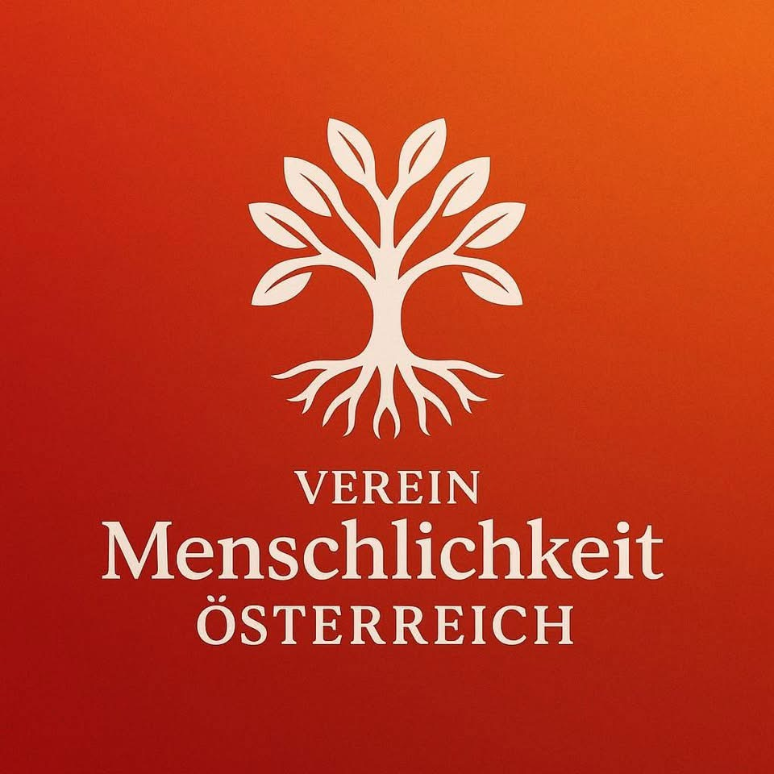

<div align="center">



# Menschlichkeit Österreich

### Digitale Plattform für Demokratie, Menschenrechte und Zivilgesellschaft

[](https://github.com/Menschlichkeit-Osterreich/menschlichkeit-oesterreich-development/actions/workflows/ci.yml)
[](https://app.codacy.com/gh/Menschlichkeit-Osterreich/menschlichkeit-oesterreich-development)
[](SECURITY.md)
[](docs/legal/WCAG-AA-COMPLIANCE-BLUEPRINT.md)
[](LICENSE)

**[Website](https://menschlichkeit-oesterreich.at) · [Mitglied werden](https://menschlichkeit-oesterreich.at/mitglied-werden) · [Spenden](https://menschlichkeit-oesterreich.at/spenden) · [Dokumentation](DOCS-INDEX.md)**

</div>

---

## Über uns – Vereinsmission

**Menschlichkeit Österreich** ist ein gemeinnütziger Verein mit dem Ziel, Demokratie, Menschenrechte und eine offene Zivilgesellschaft in Österreich zu stärken. Wir glauben: Eine lebendige Demokratie braucht informierte, engagierte Menschen – und digitale Werkzeuge, die Teilhabe niedrigschwellig ermöglichen.

Unsere drei Säulen:

- **Demokratische Teilhabe** — Interaktive Bildungsspiele, Foren und Veranstaltungen, die politische Kompetenz fördern
- **Gemeinschaft** — Ein offenes Vereinssystem, das Mitglieder vernetzt und zu gemeinsamem Handeln einlädt
- **Transparenz** — Open-Source-Plattform, DSGVO-konforme Datenhaltung, öffentliche Dokumentation

> *„Menschlichkeit ist kein Luxus – sie ist die Grundlage jeder funktionierenden Gesellschaft."*

---

## Inhaltsverzeichnis

- [Schnellstart](#-schnellstart)
- [Architektur](#️-architektur)
- [Services im Detail](#-services-im-detail)
- [OpenClaw KI-Agentensystem](#-openclaw-ki-agentensystem)
- [Projektstruktur](#-projektstruktur)
- [Entwicklung](#-entwicklung)
- [Testing](#-testing)
- [DSGVO & Sicherheit](#-dsgvo--sicherheit)
- [Design System](#-design-system)
- [Deployment](#-deployment)
- [Contributing](#-contributing)
- [Lizenz & Support](#-lizenz--support)

---

## 🚀 Schnellstart

### Voraussetzungen

| Tool | Mindestversion | Zweck |
|------|---------------|-------|
| Node.js | 22 LTS | Frontend, Tooling |
| npm | 10 | Paketmanager |
| Python | 3.12 | FastAPI Backend |
| Docker Desktop | 24 | Datenbanken, n8n |
| PHP | 8.1 | Drupal CRM (optional) |
| Git | 2.40 | Versionskontrolle |

### Installation

```bash
# 1. Repository klonen
git clone https://github.com/Menschlichkeit-Osterreich/menschlichkeit-oesterreich-development.git
cd menschlichkeit-oesterreich-development

# 2. Umgebungsvariablen anlegen
cp .env.example .env
cp apps/website/.env.example apps/website/.env.local
# → .env mit echten Werten befüllen (Datenbank, API-Keys)

# 3. Abhängigkeiten & Environments einrichten
npm run setup:dev

# 4. Infrastruktur starten (PostgreSQL, Redis, n8n)
npm run docker:up

# 5. Alle Services starten
npm run dev:all
```

### Services nach dem Start

| Service | URL | Beschreibung |
|---------|-----|-------------|
| Frontend | http://localhost:5173 | React-Vereinswebsite |
| API | http://localhost:8001 | FastAPI REST-Backend |
| CRM | http://localhost:8000 | Drupal + CiviCRM |
| Games | http://localhost:3000 | Bildungsspiele |
| n8n | http://localhost:5678 | Automatisierungsplattform |
| API-Docs | http://localhost:8001/api/docs | Swagger UI |
| Tool-Gateway | http://localhost:9101 | OpenClaw Gateway |

---

## 🏗️ Architektur

Menschlichkeit Österreich ist ein **npm-Monorepo** mit sieben spezialisierten Diensten, die über eine gemeinsame PostgreSQL-Datenbank verbunden sind.

```
┌─────────────────────────────────────────────────────────────────┐
│                    Öffentliches Internet                        │
└──────────────┬───────────────────────┬──────────────────────────┘
               │                       │
       ┌───────▼───────┐       ┌───────▼───────┐
       │   Frontend    │       │  CRM/CiviCRM  │
       │  React + Vite │       │   Drupal 10   │
       │  Port: 5173   │       │   Port: 8000  │
       └───────┬───────┘       └───────┬───────┘
               │                       │
               └──────────┬────────────┘
                          │
                  ┌───────▼───────┐
                  │   FastAPI     │
                  │   REST-API    │
                  │  Port: 8001   │
                  └───────┬───────┘
                          │
          ┌───────────────┼───────────────┐
          │               │               │
  ┌───────▼──────┐ ┌──────▼──────┐ ┌─────▼──────┐
  │  PostgreSQL  │ │    Redis    │ │    n8n     │
  │  Port: 5432  │ │  (Cache)   │ │ Port: 5678 │
  └──────────────┘ └─────────────┘ └────────────┘

  ┌─────────────────────────────────────────────┐
  │          OpenClaw KI-Agentensystem          │
  │  Tool-Gateway :9101 ↔ Agent-Runtime :9100   │
  │  NATS JetStream :4222 ↔ Qdrant :6333        │
  └─────────────────────────────────────────────┘
```

### Technologie-Stack

| Schicht | Technologie |
|---------|------------|
| Frontend | React 18, TypeScript, Vite, TailwindCSS, Radix UI |
| Backend | FastAPI (Python 3.12), Pydantic v2, asyncpg |
| CRM | Drupal 10, CiviCRM, PHP 8.1 |
| Datenbank | PostgreSQL ≥15, Redis 7, Qdrant (Vektor-DB) |
| Automatisierung | n8n (29 Workflows), NATS JetStream |
| KI | OpenClaw (6 Agenten), OpenAI GPT-4.1 |
| Testing | pytest, Vitest, Playwright |
| CI/CD | GitHub Actions, Trivy, Bandit, Gitleaks, Codacy |
| Hosting | Plesk, Docker |

---

## 📦 Services im Detail

### 🌐 Frontend (`apps/website/`)

Die öffentliche Vereinswebsite als Single-Page-Application.

**Kernfunktionen:**
- Öffentliche Seiten: Startseite, Über uns, Blog, Veranstaltungen, Forum
- Mitgliederbereich: Profil, Spenden, SEPA-Verwaltung
- Admin-Portal: Mitgliederverwaltung, KPI-Dashboard, Rollenverwaltung
- Zahlungsintegration: Stripe, PayPal, SEPA-Lastschrift

```bash
npm run dev:frontend        # Vite Dev-Server (Port 5173)
npm run build:frontend      # Produktions-Build
```

**Umgebungsvariablen:** [`apps/website/.env.example`](apps/website/.env.example)

---

### ⚙️ API (`apps/api/`)

FastAPI-Backend mit JWT-Authentifizierung, RBAC und vollständiger OpenAPI-Dokumentation.

**Endpunkte:**

| Bereich | Pfad | Beschreibung |
|---------|------|-------------|
| Auth | `/api/auth/*` | Login, Registrierung, Passwort-Reset |
| Mitglieder | `/api/members/*` | CRUD mit Rollen-Kontrolle |
| Blog | `/api/blog/articles/*` | Vereinsblog |
| Veranstaltungen | `/api/events/*` + `/rsvp` | Event-Management |
| Forum | `/api/forum/*` | Kategorien, Threads, Posts |
| Finanzen | `/api/finance/*` | Übersicht, Rechnungen |
| KPIs | `/api/kpis/*` | Metriken, Zeitreihen |
| Rollen | `/api/roles/*` | RBAC-Verwaltung |
| Health | `/healthz`, `/readyz` | Liveness/Readiness |

**OpenAPI-Spezifikation:** [`apps/api/openapi.yaml`](apps/api/openapi.yaml)

**Rollenmodell:**

| Rolle | Zugriff |
|-------|---------|
| `guest` | Öffentliche Seiten |
| `member` | Eigenes Profil, Forum, Events |
| `moderator` | + Inhaltsverwaltung |
| `admin` | + Mitgliederverwaltung, Finanzen |
| `sysadmin` | Vollzugriff |

```bash
npm run dev:api             # FastAPI + Uvicorn (Port 8001)
cd apps/api && pytest tests/ # 33 Tests ausführen
```

---

### 👥 CRM (`apps/crm/`)

Drupal 10 mit CiviCRM für Mitglieder- und Spendenverwaltung.

**Kernmodule:**
- `pii_sanitizer` — DSGVO-konformes PII-Scrubbing in Logs
- CiviCRM — Mitglieder, Spenden, Veranstaltungen, Mailing
- CiviSEPA — SEPA-Lastschriftmandat-Verwaltung

```bash
npm run dev:crm             # php -S localhost:8000 -t apps/crm/web
```

---

### 🎮 Games (`apps/game/`)

Interaktive Bildungsspiele zur Demokratieförderung.

- **Demokratie-Simulator** — Planspiel politischer Entscheidungsprozesse
- **Verfassungs-Quest** — Grundrechte spielerisch erkunden
- **Bürger-Quiz** — Wissenstest zu politischen Institutionen

```bash
npm run dev:games           # Python HTTP-Server (Port 3000)
npx prisma migrate dev      # Datenbank-Migrationen
npx prisma studio           # Datenbank-UI
```

---

### 🔄 Automatisierung (`automation/n8n/`)

29 n8n-Workflows für automatisierte Vereinsprozesse.

| Kategorie | Workflows |
|-----------|-----------|
| Mitglieder & CRM | Aufnahme, Onboarding, CRM-Sync |
| Finanzen | Spendenverarbeitung, Rechnungen, SEPA-Export, Mahnwesen |
| Events & Forum | Erinnerungen, Moderation |
| DSGVO | Löschanfragen (Art. 17 DSGVO) |
| System | Queue-Monitor, DLQ-Admin, Build-Pipelines |
| Social | Crosspost, Stripe → CiviCRM |

```bash
npm run docker:up           # n8n + PostgreSQL + Redis starten
# Interface: http://localhost:5678
```

---

## 🤖 OpenClaw KI-Agentensystem

OpenClaw ist das interne Multi-Agent-System, das Entwicklungsaufgaben automatisiert. Alle sechs Agenten kommunizieren über NATS JetStream und nutzen eine Policy-Engine (Tool-Gateway) für sicheren Werkzeugzugriff.

### Agenten

| Agent | Rolle | Hauptwerkzeuge |
|-------|-------|---------------|
| `orchestrator` | Koordiniert alle Agenten, verteilt Tasks | `nats.publish`, `redis.*`, `db.query_readonly` |
| `research` | Web-Recherche, Quellen-Analyse | `http.fetch`, `fs.read`, `qdrant.upsert` |
| `builder` | Code schreiben, Git-Commits, PRs vorbereiten | `fs.*`, `git.status/diff/commit/pr_prepare` |
| `qa` | Tests, Code-Qualität, Validierung | `ci.run_local`, `fs.read`, `git.diff` |
| `automation` | n8n-Workflows triggern | `n8n.trigger_webhook`, `n8n.get_status` |
| `monetization` | Kosten-Analyse, KPI-Berichte | `db.query_readonly`, `http.fetch` |

### Pipelines

```
content_factory:     research → builder → qa → automation → monetization
devops_assistant:    research → builder → qa → builder (PR-Draft)
crm_community_ops:   research → automation → monetization
```

### Infrastruktur

| Komponente | Port | Beschreibung |
|-----------|------|-------------|
| Tool-Gateway | 9101 | Policy-Engine, Audit-Log, Werkzeug-Router |
| Agent-Runtime | 9100 | Orchestrierung, Task-Queue |
| NATS JetStream | 4222 | Nachrichten-Bus |
| Qdrant | 6333 | Vektordatenbank (Agenten-Gedächtnis) |
| PostgreSQL (OC) | 55432 | Separate Agent-Datenbank |
| Redis (OC) | 6380 | Agent-Cache |

```bash
bash openclaw-system/scripts/boot.sh    # Stack starten
bash openclaw-system/scripts/smoke.sh   # Smoke-Tests
```

**Konfiguration:**
- [`openclaw-system/configs/agent_roles.yaml`](openclaw-system/configs/agent_roles.yaml) — Rollen & System-Prompts
- [`openclaw-system/configs/capabilities.yaml`](openclaw-system/configs/capabilities.yaml) — Tool-Whitelist & Budgets
- [`openclaw-system/ARCHITECTURE.md`](openclaw-system/ARCHITECTURE.md) — Technische Dokumentation

---

## 📁 Projektstruktur

```
menschlichkeit-oesterreich-development/
│
├── apps/                               # Primäre Services
│   ├── website/                        # React 18 + Vite (Port 5173)
│   │   ├── src/
│   │   │   ├── components/             # UI-Komponenten
│   │   │   ├── pages/                  # Seitenrouten
│   │   │   └── services/               # API-Clients
│   │   └── .env.example
│   │
│   ├── api/                            # FastAPI (Port 8001)
│   │   ├── app/
│   │   │   ├── routers/                # auth, blog, events, finance, forum…
│   │   │   ├── middleware/             # PII-Sanitization, Security-Header
│   │   │   ├── lib/                    # pii_sanitizer, token_blacklist
│   │   │   ├── rbac.py                 # JWT + Rollenmodell
│   │   │   └── audit.py                # Audit-Trail
│   │   ├── tests/                      # pytest Suite (33 Tests)
│   │   └── openapi.yaml                # OpenAPI 3.1
│   │
│   ├── crm/                            # Drupal 10 + CiviCRM (Port 8000)
│   │   └── web/modules/custom/
│   │       └── pii_sanitizer/          # DSGVO-Drupal-Modul
│   │
│   └── game/                           # Bildungsspiele (Port 3000)
│
├── packages/                           # Gemeinsame Pakete (Monorepo)
│   ├── design-system/                  # Design-Tokens
│   └── ui/                             # Gemeinsame React-Komponenten
│
├── openclaw-system/                    # KI-Agentensystem
│   ├── api/fastapi_gateway/            # Tool-Gateway (Port 9101)
│   ├── core/agent_runtime/             # Agentensteuerung (Port 9100)
│   ├── configs/                        # agent_roles, capabilities, system_config
│   ├── services/postgres/init.sql      # Agent-DB-Initialisierung
│   ├── windows-bridge/                 # WSL2 ↔ Windows-Brücke (Port 18790)
│   └── ARCHITECTURE.md
│
├── automation/
│   └── n8n/
│       ├── workflows/                  # 29 JSON-Workflows
│       └── custom-nodes/pii-sanitizer/ # DSGVO-n8n-Node
│
├── figma-design-system/                # Design-Tokens (Figma-Export)
│   └── 00_design-tokens.json
│
├── scripts/
│   ├── init-db.sql                     # PostgreSQL-Initialisierung
│   └── db-user-setup.sql
│
├── .github/workflows/                  # CI/CD (Node 22, Python 3.12)
├── .env.example                        # Alle Umgebungsvariablen
├── CLAUDE.md                           # KI-Entwicklungsanweisungen
├── CONTRIBUTING.md
├── SECURITY.md
└── package.json                        # npm Workspaces Root
```

---

## 🛠️ Entwicklung

### Kommando-Referenz

#### Setup & Dev

```bash
npm run setup:dev           # Vollständiges Setup
npm run dev:all             # Alle Services starten
npm run dev:frontend        # Frontend (Vite, :5173)
npm run dev:api             # API (Uvicorn, :8001)
npm run dev:crm             # CRM (PHP, :8000)
npm run dev:games           # Games (Python, :3000)
npm run docker:up           # PostgreSQL + Redis + n8n
```

#### Linting & Formatierung

```bash
npm run lint                # ESLint
npm run lint:all            # JS + PHP + Markdown
npm run lint:php            # PHPStan
npm run format              # Prettier
npm run format:php          # php-cs-fixer
```

#### Testing

```bash
npm run test:unit                         # Vitest
npm run test:e2e                          # Playwright
cd apps/api && pytest tests/ -v           # Python API-Tests
cd apps/api && pytest tests/test_pii_sanitizer.py  # PII isoliert
```

#### Quality Gates (PR-blockierend)

```bash
npm run quality:gates       # Codacy + Security + Lighthouse + DSGVO
npm run security:scan       # Trivy + Bandit + Gitleaks
npm run performance:lighthouse
npm run compliance:dsgvo
```

#### Datenbank

```bash
npm run docker:up           # Datenbanken starten
npx prisma migrate dev      # Prisma-Migrationen (Games)
npx prisma generate         # Client regenerieren
npx prisma studio           # Datenbank-UI
```

#### Build & Deploy

```bash
npm run build:frontend
./build-pipeline.sh staging
./build-pipeline.sh production
```

### Git-Workflow

```
main (geschützt)
└── develop
    ├── feature/<issue>-<beschreibung>
    ├── fix/<issue>-<beschreibung>
    └── docs/<issue>-<beschreibung>
```

**Conventional Commits** (via commitlint):

```
feat(scope): neue Funktion       → Minor-Version-Bump
fix(scope): Fehlerkorrektur      → Patch-Version-Bump
docs/test/chore/refactor         → kein Version-Bump
```

---

## 🧪 Testing

### Übersicht

| Ebene | Framework | Befehl |
|-------|-----------|--------|
| Python Unit | pytest | `cd apps/api && pytest tests/` |
| JavaScript Unit | Vitest | `npm run test:unit` |
| End-to-End | Playwright | `npm run test:e2e` |

### Python Test-Suite (`apps/api/tests/`)

```
tests/
├── conftest.py           # DB-Mocking, JWT-Fixtures (ohne PostgreSQL)
├── test_health.py        # Liveness / Readiness / Version-Endpunkte
├── test_pii_sanitizer.py # E-Mail, IBAN, Telefon, Kreditkarte, Freitext
├── test_rbac.py          # JWT-Lifecycle, Rollenprüfung, Auth-Endpunkte
└── test_security.py      # Rate-Limiter, Security-Middleware
```

```bash
cd apps/api && pytest tests/ -v
# 33 passed ✓
```

---

## 🔐 DSGVO & Sicherheit

### PII-Sanitization

Alle personenbezogenen Daten werden automatisch aus Logs entfernt:

| PII-Typ | Maskierung | Beispiel |
|---------|-----------|---------|
| E-Mail | `t**@domain.com` | `test@example.com` → `t**@example.com` |
| IBAN | `AT61***` | Nur Prüfziffer-validierte IBANs |
| Telefon | `+43*********` | Alle Formate (+43, 0664, mit Leerzeichen) |
| Kreditkarte | `[CARD]` | Nur Luhn-validierte Nummern |
| JWT / Bearer | `[JWT_REDACTED]` | Tokens in Headern und Logs |
| IPv4 | `1.2.*.*` | Letzte zwei Oktette |

**Implementierung:**
- FastAPI: [`apps/api/app/lib/pii_sanitizer.py`](apps/api/app/lib/pii_sanitizer.py) + [`app/middleware/pii_middleware.py`](apps/api/app/middleware/pii_middleware.py)
- Drupal: [`apps/crm/web/modules/custom/pii_sanitizer/`](apps/crm/web/modules/custom/pii_sanitizer/)
- n8n: [`automation/n8n/custom-nodes/pii-sanitizer/`](automation/n8n/custom-nodes/pii-sanitizer/)

### DSGVO-Rechte (Art. 15–21 DSGVO)

| Recht | Umsetzung |
|-------|----------|
| Auskunft (Art. 15) | `GET /api/members/me/profile` |
| Berichtigung (Art. 16) | `PUT /api/members/{id}` |
| Löschung (Art. 17) | n8n-Workflow `right-to-erasure` |
| Einschränkung (Art. 18) | Status-Verwaltung im CRM |
| Datenportabilität (Art. 20) | Export via CiviCRM |

### Security-Checkliste

- ✅ JWT mit HMAC-SHA256, Ablauftoken, Blacklist
- ✅ Rate-Limiting (120 req/min Standard, konfigurierbar)
- ✅ CSP, HSTS, X-Frame-Options Security-Header
- ✅ PII-Sanitization in allen Log-Ebenen
- ✅ Audit-Trail für alle sensiblen Aktionen
- ✅ Dependency-Scanning (Trivy), Secret-Scanning (Gitleaks)
- ✅ SQL-Injection-Schutz (parametrisierte Queries via asyncpg)

**Sicherheitslücke melden:** [SECURITY.md](SECURITY.md) · `security@menschlichkeit-oesterreich.at`

---

## 🎨 Design System

Alle Frontends nutzen **Figma Design Tokens** für konsistente Corporate Identity (Rot-Weiß-Rot).

```bash
npm run figma:sync          # Tokens aus Figma synchronisieren
```

- Tokens: [`figma-design-system/00_design-tokens.json`](figma-design-system/00_design-tokens.json)
- Tailwind-Config: [`apps/website/tailwind.config.cjs`](apps/website/tailwind.config.cjs)

**Regel:** Niemals Farben oder Abstände hardcoden – immer Design-Tokens verwenden.

---

## 🚢 Deployment

### Umgebungen

| Umgebung | URL | Branch | Auslöser |
|----------|-----|--------|---------|
| Lokal | `localhost:*` | beliebig | manuell |
| Staging | `staging.menschlichkeit-oesterreich.at` | `develop` | automatisch |
| Produktion | `menschlichkeit-oesterreich.at` | `main` | mit Genehmigung |

### Pipeline

```bash
./build-pipeline.sh staging              # Staging
./build-pipeline.sh production           # Produktion
./build-pipeline.sh production --dry-run # Vorschau
```

**Quality Gates (PR-blockierend):**

| Gate | Schwellwert |
|------|------------|
| Security | 0 kritische Issues |
| Code-Qualität | ≥85% Wartbarkeit, ≤2% Duplikation |
| Performance | Lighthouse ≥90 (Performance, A11y, SEO) |
| DSGVO | 0 PII in Logs |

---

## 🤝 Contributing

Wir freuen uns über jeden Beitrag! Bitte lies zuerst:
- [CONTRIBUTING.md](CONTRIBUTING.md) — Beitragsrichtlinien
- [CODE_OF_CONDUCT.md](CODE_OF_CONDUCT.md) — Verhaltenskodex

```bash
# 1. Repository forken & klonen
git clone https://github.com/DEIN-USERNAME/menschlichkeit-oesterreich-development.git

# 2. Feature-Branch erstellen
git checkout -b feature/42-meine-verbesserung

# 3. Änderungen machen & testen
npm run test:unit && npm run lint

# 4. Commit (Conventional Commits!)
git commit -m "feat(forum): Reaktionen auf Beiträge hinzugefügt"

# 5. Quality Gates prüfen
npm run quality:gates

# 6. Push & Pull Request
git push origin feature/42-meine-verbesserung
```

**Kontakt:** `dev@menschlichkeit-oesterreich.at`

---

## 📄 Lizenz & Support

**Lizenz:** [MIT](LICENSE) — freie Nutzung mit Namensnennung.

### Kontakt & Support

| Anliegen | Kanal |
|---------|-------|
| 🐛 Bugs | [GitHub Issues](https://github.com/Menschlichkeit-Osterreich/menschlichkeit-oesterreich-development/issues/new?template=bug_report.md) |
| 💡 Feature-Wünsche | [Feature Request](https://github.com/Menschlichkeit-Osterreich/menschlichkeit-oesterreich-development/issues/new?template=feature_request.md) |
| 🔒 Sicherheitslücken | security@menschlichkeit-oesterreich.at |
| 👩‍💻 Entwickler | dev@menschlichkeit-oesterreich.at |
| 🌐 Allgemein | [menschlichkeit-oesterreich.at](https://menschlichkeit-oesterreich.at) |

### Weitere Dokumentation

| Dokument | Inhalt |
|---------|--------|
| [CLAUDE.md](CLAUDE.md) | KI-Entwicklungsanweisungen, Befehle, Architekturdetails |
| [CONTRIBUTING.md](CONTRIBUTING.md) | Ausführliche Beitragsrichtlinien |
| [SECURITY.md](SECURITY.md) | Sicherheitsrichtlinien, Responsible Disclosure |
| [CODE_OF_CONDUCT.md](CODE_OF_CONDUCT.md) | Verhaltenskodex |
| [CHANGELOG.md](CHANGELOG.md) | Versionshistorie |
| [DOCS-INDEX.md](DOCS-INDEX.md) | Vollständiger Dokumentationsindex |
| [openclaw-system/ARCHITECTURE.md](openclaw-system/ARCHITECTURE.md) | OpenClaw-Architektur |
| [apps/api/openapi.yaml](apps/api/openapi.yaml) | REST-API Spezifikation |

---

<div align="center">

**[menschlichkeit-oesterreich.at](https://menschlichkeit-oesterreich.at)**

*Für eine offene, demokratische Gesellschaft in Österreich* 🇦🇹

Made with ❤️ in Austria · FastAPI · React · Drupal · n8n · OpenClaw

</div>
